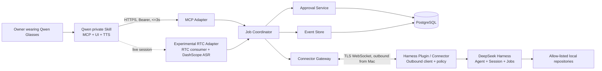

# Qwen Harness Bridge Product and System Design

**Status:** Approved design baseline  
**Date:** 2026-09-01  
**Working product name:** Qwen Harness Bridge（眼镜任务台）  
**Repository name:** `qwen-harness-bridge`  
**Initial audience:** One owner, one pair of Qwen AI Glasses S1, one Mac

## 1. Executive summary

Qwen Harness Bridge lets the owner assign software-development tasks from Qwen AI Glasses to DeepSeek Harness running on an authorized Mac. The glasses provide voice input, native task-list/detail UI, approval decisions, result summaries, and an optional live RTC conversation. A small cloud control plane persists jobs and events, while a DeepSeek Harness plugin on the Mac maintains an authenticated outbound connection and retains final authority over local execution.

The stable product path is asynchronous: every Qwen MCP call completes inside the documented three-second limit, while the Mac performs the long-running task independently. The experimental RTC path adds session-scoped spoken progress and highlighted text without becoming a release dependency.

The design intentionally does not expose DeepSeek Harness or a general shell to the public internet. It also does not depend on enterprise-only Qwen capabilities such as a desktop icon, offline device push, a native SDK, or a custom-device program.

## 2. Product problem

Long-running agent tasks are awkward to start and monitor while away from a keyboard. Qwen AI Glasses have enough public Skill, MCP, UI, TTS, camera, location, and RTC capability to act as a lightweight agent terminal, but Qwen tool calls have short response budgets and cannot directly reach a Mac behind NAT.

The product must therefore solve five problems:

1. Accept a voice request and return a stable job identifier in under three seconds.
2. Dispatch the job to a specific authorized Mac without opening an inbound port.
3. Preserve task state, progress, approvals, and results across network and process restarts.
4. Make the interaction legible on a small monochrome display and usable by voice.
5. Prevent a compromised cloud token or ambiguous voice command from becoming unrestricted local execution.

## 3. Goals and non-goals

### 3.1 V1 goals

- Create a development task from the glasses and receive a `job_id` within three seconds.
- Dispatch an accepted task to an online Mac within five seconds.
- Restrict execution to explicitly configured local repositories.
- Show recent tasks, current stage, status freshness, pending approvals, and result summaries on the glasses.
- Support cancel, approve, and reject commands with idempotent semantics.
- Restore job state after control-plane restart or Connector reconnect.
- Keep complete terminal output, source files, credentials, and environment variables off the cloud control plane.
- Provide an experimental RTC mode for session-scoped spoken progress without coupling stable-mode availability to RTC.
- Manage source, product progress, milestones, versions, release notes, and decisions in a public GitHub repository.

### 3.2 V1 non-goals

- Qwen glasses desktop icons or an independent native glasses application.
- Notifications after the user has left the Skill or RTC session.
- iOS/Android Professional SDK integration.
- Arbitrary shell access, arbitrary filesystem paths, or general-purpose desktop automation.
- Multi-user tenancy, billing, enterprise administration, or public marketplace distribution.
- Full remote desktop, screen streaming, keyboard/mouse control, or unrestricted clipboard access.
- RTC availability as a stable-release requirement.

## 4. Product modes

### 4.1 Stable asynchronous mode

The user invokes the private Skill, submits a task, and immediately receives a short job identifier. The job runs asynchronously. The user can later open the task list, inspect a task, cancel it, answer an approval, or request the result.

This mode is the release-critical path and must remain usable when RTC, ASR, or live speech delivery is unavailable.

### 4.2 Experimental live mode

The user says “进入 DeepSeek 实时模式.” The Skill starts the documented Qwen audio or video RTC flow. The RTC Adapter consumes audio, uses DashScope streaming ASR, and routes recognized utterances to the same Job Coordinator used by stable mode. Meaningful job events can be emitted as `SPEAK` fragments with `APPEND_HIGHLIGHT` while the session remains active.

The live mode obeys these rules:

- Send SSE keep-alive frames every 30 seconds while idle.
- Treat 90 seconds without a complete frame as a closed session.
- Do not assume reconnect, replay, or offline delivery.
- Rate-limit progress speech to one update per 10 seconds unless an approval or terminal event occurs.
- Fall back to stable-mode queries after any RTC failure.

## 5. User journeys

### 5.1 Submit and monitor a task

1. User: “让 DeepSeek 修复 Novelty Studio 的登录测试。”
2. Skill resolves the configured repository alias and calls `submit_task` once with a per-turn idempotency key.
3. Control Plane persists the job as `queued` and returns `QH-7M2P` within three seconds.
4. Glasses say: “任务 QH-7M2P 已创建。”
5. Connector claims the job and starts or resumes a DeepSeek Harness session.
6. User: “打开任务台。”
7. Skill renders the five most recent tasks with `UiTool.list`.
8. User: “查看第一个任务。”
9. Skill renders stage, freshness, recent event, and result summary with `UiTool.all_text`.

### 5.2 Approve a risky action

1. Harness requests an action that the local policy marks as approval-required.
2. Connector emits `approval.requested` with a human-readable summary, risk class, expiry, and action fingerprint.
3. Job becomes `waiting_approval`.
4. User asks for pending approvals or opens the task.
5. Glasses display the action, impact, repository, and expiry.
6. User says “批准任务三” or “拒绝任务三.”
7. Control Plane records one immutable decision and sends it to the Connector.
8. Connector validates the decision, task revision, expiry, and fingerprint. Local policy may still reject it.

### 5.3 Recover after disconnect

1. Connector connection drops while Harness may still be running.
2. Control Plane preserves job state and marks connector freshness as `stale`, then `offline` after 30 seconds without heartbeat.
3. It does not dispatch a second execution attempt automatically.
4. Connector reconnects with its last acknowledged server and event sequence numbers.
5. Connector and Control Plane reconcile the existing Harness session before accepting new work for the same job.
6. If the session cannot be verified by the task timeout, the job fails with `CONNECTOR_LOST`; it is never silently rerun.

## 6. System architecture



### 6.1 Trust boundaries

- Qwen Skill can invoke only the published MCP tools and official UI/RTC tools.
- Control Plane can schedule and record requests but cannot directly open files or execute commands on the Mac.
- Harness Plugin / Connector owns the final repository allow-list, policy evaluation, and action execution decision.
- DeepSeek Harness remains local and is never exposed as an unauthenticated public HTTP service.
- Full logs and repository data remain on the Mac; cloud events are redacted and bounded.

## 7. Components and responsibilities

### 7.1 Qwen Skill

The Skill is a single-intent task-control Skill. Its `SKILL.md` contains:

- Trigger phrases for creating, listing, inspecting, cancelling, approving, and rejecting tasks.
- Repository alias resolution rules; the model cannot invent repository IDs.
- A rule to call `submit_task` at most once per user turn.
- Explicit UI orchestration using `UiTool.list`, `UiTool.all_text`, and `UiTool.pic_and_text`.
- Concise Chinese TTS templates.
- Error-code-to-friendly-message mappings.
- RTC entry and exit instructions behind a feature flag.

### 7.2 Cloud Control Plane

V1 is one deployable modular monolith with these internal modules:

- **MCP Adapter:** authenticates Qwen calls, validates runtime schemas, enforces response budgets, and returns bounded response objects.
- **Job Coordinator:** owns the state machine, idempotency, dispatch leases, cancellation races, and timeouts.
- **Connector Gateway:** authenticates Connector sessions and carries versioned WebSocket envelopes with ACK and replay.
- **Approval Service:** creates, expires, and records decisions bound to action fingerprints and job revisions.
- **Event Store:** appends immutable redacted job events and builds read models for the glasses.
- **RTC Adapter:** optional Qwen session endpoints, RTC consumer, ASR adapter, serialized SSE writer, and speech rate limiter.
- **Operations API:** local/admin-only health, metrics, and connector diagnostics; it is not published as a Qwen tool.

### 7.3 PostgreSQL

PostgreSQL is authoritative for jobs, events, approvals, connectors, repository aliases, idempotency records, and protocol cursors. State transitions use transactions and optimistic revisions. Event append and job read-model update occur in one transaction.

### 7.4 Harness Plugin / Connector

The TypeScript DeepSeek Harness extension exports `apply(ctx)` and starts an embedded Connector client. It:

- Retrieves its long-lived bootstrap credential from macOS Keychain.
- Exchanges the credential for a short-lived session token.
- Establishes an outbound TLS WebSocket and maintains heartbeat, ACK, reconnect, and replay cursors.
- Validates every command envelope, expiry, nonce, protocol version, and job attempt.
- Resolves repository aliases to canonical real paths and rejects symlink escapes.
- Creates or resumes a DeepSeek Harness Agent/Session.
- Maps cloud `job_id` values to local Harness session and job identifiers.
- Listens to Harness session/job events and emits normalized, redacted events.
- Persists local mappings and unsent events in a local SQLite database.
- Converts Harness approval requests into product approvals and validates returned decisions.

### 7.5 Local Policy Engine

The policy engine evaluates canonical action records rather than natural-language summaries. Each action includes executable/tool identity, arguments, working directory, repository ID, environment-access flags, network intent, file-change class, and external-side-effect class.

V1 policy classes are:

- `automatic`: read operations, tests, builds, and bounded edits inside the allow-listed repository.
- `approval_required`: package installation, deployment, network writes, external messages, destructive file changes, or access outside the repository.
- `denied`: arbitrary shell payloads from the glasses, secret extraction, credential-store access, system settings, and paths outside configured roots.

An approval can move an `approval_required` action to executable, but it can never override `denied`.

## 8. Public MCP contract

All tools use JSON Schema, return bounded JSON, and target a two-second server budget so the complete Qwen path remains below three seconds.

### 8.1 `submit_task`

Input:

```ts
type SubmitTaskInput = {
  client_request_id: string; // UUID generated once per Skill turn and reused on retry
  repository_id: string;     // configured alias, never an arbitrary path
  request: string;           // 1..4000 UTF-8 characters
  mode?: "normal" | "read_only";
};
```

Output:

```ts
type JobReceipt = {
  job_id: string;
  short_id: string;
  status: "queued";
  connector_status: "online" | "offline";
  accepted_at: string;
  expires_at: string;
};
```

The unique key is `(owner_id, client_request_id)`. A repeated key with the same payload returns the original receipt; the same key with a different payload returns `IDEMPOTENCY_CONFLICT`.

### 8.2 `list_tasks`

Input permits `limit` from 1 to 5, an optional status filter, and `unread_only`. Output includes short ID, title, public status, current stage, freshness, unread terminal flag, and last update. It never includes raw prompts or logs.

### 8.3 `get_task`

Input is `job_id`. Output includes repository display name, public status, current stage, connector freshness, last five redacted events, pending approval summary, terminal summary, and revision.

### 8.4 `cancel_task`

Input contains `job_id` and `expected_revision`. Queued jobs cancel immediately. Running jobs become `cancelling` until Connector ACK or a competing terminal event wins. Repeated cancellation returns the current state without creating another command.

### 8.5 `list_pending_approvals`

Returns at most five unexpired approvals with approval ID, job short ID, job revision, action summary, impact summary, risk class, and expiry.

### 8.6 `decide_approval`

Input contains `approval_id`, `decision: "approve" | "reject"`, and `expected_job_revision`. Only the first valid decision is accepted. Expired, mismatched, superseded, or already-decided approvals return a stable domain error.

### 8.7 `get_task_result`

Returns a bounded terminal summary, changed-file names relative to the repository, test summary, artifact metadata, and `acknowledged_at`. Calling it acknowledges the unread terminal result idempotently.

## 9. Connector protocol

Every WebSocket message uses this envelope:

```ts
type Envelope<T> = {
  protocol_version: "1.0";
  message_id: string;
  sequence: number;
  sent_at: string;
  expires_at: string;
  correlation_id: string;
  payload: T;
};
```

Client messages:

- `connector.hello`
- `connector.heartbeat`
- `job.claim`
- `job.event`
- `approval.requested`
- `job.cancelled`
- `ack`

Server messages:

- `connector.welcome`
- `job.offer`
- `job.cancel`
- `approval.decision`
- `ack`
- `protocol.error`

Delivery is at least once. Receivers deduplicate by `message_id` and sequence. A job attempt is claimed by transactional compare-and-swap and executed at most once by product orchestration. The system does not claim exactly-once execution across arbitrary external side effects; action fingerprints and local Harness semantics must make retryable operations idempotent where possible.

Connector heartbeat interval is 10 seconds. Control Plane marks the connection stale after 20 seconds and offline after 30 seconds. A dispatch offer lease lasts 30 seconds. Unclaimed jobs remain queued until their job expiry.

### 9.1 Negotiated durable receipt recovery

The stable Harness Connector requires the `durable-receipts-v1` capability, requested in hello and explicitly echoed in an optional welcome capabilities array. Legacy peers that do not request it retain their existing welcome shape and behavior. A missing echo is an incompatible peer, not permission to dispatch work under weaker recovery rules.

Under this capability, only a client envelope's delivery `expires_at` may be renewed before transmission; message identity, sequence, original send time, correlation and payload remain immutable. Business deadlines and server-command execution deadlines cannot be renewed. Valid receipt ACKs prove durable consumption of a contiguous client prefix, including consumed business rejections, and never authorize execution. The server acknowledges consumed client ACK frames; the client does not acknowledge server ACKs, preventing receipt loops. Persist the proven prefix and active hello anchor, retain uncertain rows on shutdown, and bound unconfirmed transmission to 32 frames and 128 KiB. Recheck incoming command expiry after receipt and before execution.

Identity binding, rejection rollback, lease bounds, tombstone restoration, compatibility behavior and required interoperability evidence are specified in [ADR 0001](../../adr/0001-durable-connector-receipts.md). This negotiated correction implements durable recovery without renumbering or silently dropping allocated messages.

## 10. Job and approval model

### 10.1 Public job states

```text
queued -> dispatched|cancelled|expired
dispatched -> running|cancelled|expired
running -> waiting_approval|cancelling|succeeded|failed|expired
waiting_approval -> running|cancelling|failed|expired
cancelling -> cancelled|succeeded|failed|expired
```

Terminal states are immutable. Connector health is a separate dimension: `fresh`, `stale`, or `offline`. A running job with offline health is shown as “连接中断，正在协调,” not as a new job state and not as a percentage.

### 10.2 Core records

- `Job`: owner, connector, repository, encrypted request, status, stage, revision, Harness IDs, deadlines, summary, unread marker, timestamps.
- `JobEvent`: job ID, monotonically increasing sequence, event type, redacted payload, source, correlation ID, timestamp.
- `Approval`: job ID, action summary, impact summary, canonical action fingerprint, risk class, job revision, expiry, decision, decision timestamp.
- `Connector`: owner, public key/credential ID, capabilities, protocol version, health, replay cursors, last heartbeat.
- `RepositoryPolicy`: stable ID, display name, canonical local path, allowed action classes, time limits, concurrency.
- `IdempotencyRecord`: owner, client request ID, request digest, job ID, expiry.

### 10.3 Default time limits

- Queued job expiry: 24 hours.
- Running task timeout: 60 minutes.
- Approval expiry: 5 minutes, configurable from 1 to 30 minutes per repository.
- Idempotency record: 24 hours.
- Cloud redacted job/event retention: 30 days.
- Encrypted original request deletion: 24 hours after terminal state.
- Local full-log retention: 7 days.

## 11. Glasses UI and voice behavior

### 11.1 Task list

“打开任务台” calls `list_tasks(limit=5)` and renders `UiTool.list`.

Each item contains:

- Title: ordinal, short job ID, and task title.
- Subtitle: localized status, current stage, and freshness.
- Simple HTTPS icon no larger than the documented list recommendation.

### 11.2 Task detail

“查看第一个任务” resolves the ordinal from the immediately preceding list response, then calls `get_task`. `UiTool.all_text` renders repository, stage, freshness, last update, recent events, approval state, and summary.

Display limits chosen for legibility:

- Five list items.
- Item subtitle no longer than 36 Chinese characters after normalization.
- Detail Markdown no longer than 600 Chinese characters.
- Spoken summary no longer than 120 Chinese characters unless the user explicitly asks to continue.

### 11.3 Approval UI

The detail view displays action, impact, repository, and expiry. The Skill accepts only an ordinal from the current pending-approval list or an exact short ID. Ambiguous references trigger one clarification; the Skill never guesses.

### 11.4 Results and artifacts

Text results use `UiTool.all_text`. A single visual artifact with a public, time-limited HTTPS URL can use `UiTool.pic_and_text`. The cloud never publishes arbitrary local files automatically; Connector must classify and explicitly upload an allowed artifact.

## 12. Error handling and user messages

Stable domain errors:

| Code | Behavior shown to user |
|---|---|
| `CONNECTOR_OFFLINE` | “Mac 当前离线，任务已排队。” |
| `REPOSITORY_NOT_ALLOWED` | “这个仓库没有授权，任务未创建。” |
| `JOB_NOT_FOUND` | “没有找到这个任务，请重新打开任务台。” |
| `JOB_NOT_MUTABLE` | “任务已经结束，不能再执行这个操作。” |
| `IDEMPOTENCY_CONFLICT` | “请求标识冲突，请重新发起任务。” |
| `APPROVAL_EXPIRED` | “批准请求已过期，默认拒绝。” |
| `APPROVAL_MISMATCH` | “任务内容已变化，请查看新的批准请求。” |
| `POLICY_DENIED` | “本地安全策略不允许这个操作。” |
| `HARNESS_FAILED` | “Harness 执行失败，可以查看错误摘要。” |
| `TASK_TIMEOUT` | “任务超过最长运行时间，已停止。” |
| `CONNECTOR_LOST` | “连接中断且无法恢复，任务没有自动重跑。” |
| `RATE_LIMITED` | “请求太频繁，请稍后再试。” |
| `INTERNAL` | “服务暂时不可用，请稍后再试。” |

Internal errors carry correlation IDs in logs but not verbose stack traces on the glasses.

## 13. Security and privacy

### 13.1 Authentication

- Qwen MCP calls use a dedicated high-entropy Bearer credential bound to the single owner.
- Connector bootstrap uses a separate per-device credential stored in macOS Keychain.
- Bootstrap credential exchanges for a short-lived 15-minute Connector session token.
- All traffic uses TLS. WebSocket envelopes include expiry and unique message IDs.
- Credentials are independently revocable and never reused across Qwen and Connector trust domains.

### 13.2 Authorization and replay defense

- Control Plane authorizes every job against owner, connector, and repository IDs.
- Connector validates canonical path membership locally.
- Commands include expiry, job attempt, revision, and nonce.
- Approval decisions bind to a SHA-256 fingerprint of the canonical action record, job ID, attempt, and revision.
- Expired approvals and commands fail closed.

### 13.3 Data minimization

- Full terminal output, environment, source content, and secrets never enter cloud events.
- Connector uses field-level and pattern-based redaction before upload.
- Original task request is encrypted at rest only while needed for offline dispatch and is deleted 24 hours after terminal completion.
- Cloud retains bounded redacted summaries for 30 days.
- Structured logs prohibit credential values, RTC tokens, raw audio, and full prompt/result bodies.

## 14. Observability and operations

Every request and event carries a correlation ID. JSON logs include job ID, connector ID, message type, sequence, state transition, duration, and stable error code.

Metrics:

- MCP submit latency p50/p95/p99 and three-second budget violations.
- Queue age and dispatch latency.
- Connector online/stale/offline state and reconnect count.
- Job counts and duration by terminal state.
- Event delivery lag, deduplication count, and replay depth.
- Approval request, decision, expiry, and mismatch counts.
- RTC session count, first audio frame, ASR final, first output, and disconnect reason.

Health endpoints separate process liveness, database readiness, and Connector availability. Database backups run daily with seven-day retention for V1. Restore is tested before the private beta milestone.

## 15. Repository and engineering design

### 15.1 Monorepo layout

```text
qwen-harness-bridge/
├── apps/
│   └── control-plane/       # MCP, jobs, approvals, WS gateway, RTC feature
├── packages/
│   ├── protocol/            # shared runtime schemas and generated TS types
│   ├── harness-plugin/      # DeepSeek Harness extension and local policy
│   └── qwen-skill/          # SKILL.md, UI workflow, import examples
├── tests/
│   ├── contract/
│   ├── integration/
│   ├── security/
│   └── e2e/
├── docs/
│   ├── product/
│   ├── architecture/
│   ├── adr/
│   ├── runbooks/
│   ├── research/
│   └── superpowers/
├── .github/
│   ├── ISSUE_TEMPLATE/
│   └── workflows/
├── CHANGELOG.md
├── CONTRIBUTING.md
├── README.md
└── SECURITY.md
```

### 15.2 Technology choices

- TypeScript monorepo managed by pnpm workspaces.
- Node.js 20 or newer runtime compatibility; CI tests the minimum supported runtime and the current LTS runtime.
- Fastify control-plane HTTP server.
- Official Model Context Protocol TypeScript SDK for the MCP endpoint.
- Zod runtime schemas exported by `packages/protocol`.
- PostgreSQL with Drizzle ORM and checked migrations.
- Native WebSocket transport with a versioned application protocol.
- Vitest for unit/contract tests and Testcontainers for PostgreSQL integration tests.
- Biome for formatting and linting, TypeScript strict mode for static checks.
- OCI image and Docker Compose for reproducible local deployment; cloud host remains replaceable by design.

### 15.3 GitHub workflow

- Public repository named `qwen-harness-bridge`.
- Protected `main`; short-lived branches and pull requests.
- Conventional Commits and a single synchronized SemVer version in V1.
- Automated `CHANGELOG.md` and GitHub Release notes from Changesets.
- Required CI: format, lint, typecheck, unit, contract, integration, security, build, and documentation-link checks.
- Labels: `type:*`, `area:*`, `priority:*`, and `risk:*`.
- Every architecture or protocol change requires an ADR and spec reference in the pull request.

### 15.4 Milestones and versions

| Milestone | Release | Exit condition |
|---|---:|---|
| M0 Product and technical baseline | `v0.1.0` | Repository, schemas, state machine, fake end-to-end Connector |
| M1 Async task loop | `v0.2.0` | Real Harness plugin submits events and restores sessions |
| M2 Glasses UI and approvals | `v0.3.0` | Private Skill passes sandbox and device task/approval flows |
| M3 Reliability and security | `v0.4.0` | Reconnect, replay, timeout, redaction, threat tests pass |
| M4 Experimental RTC | `v0.5.0` | Ten enter/multi-turn/exit/re-enter cycles pass without stable-mode regression |
| M5 Private beta | `v1.0.0` | Full acceptance suite, runbooks, backup restore, rollback rehearsal |

## 16. Test strategy

### 16.1 Unit tests

- Job state transition table and terminal immutability.
- Idempotency replay and conflict.
- Dispatch lease and cancellation races.
- Approval expiry, fingerprint, one-time decision, and local denial.
- Canonical path and symlink-escape rejection.
- Redaction of tokens, environment variables, URLs with sensitive query values, and private paths.
- UI truncation and status localization.

### 16.2 Contract tests

- Every MCP input/output schema and error object.
- Every Connector envelope and protocol-version rejection.
- Two-second server response budget for `submit_task` under expected single-user load.
- Backward compatibility for protocol `1.x` additive fields.

### 16.3 Integration tests

- PostgreSQL transactions and optimistic revisions.
- Fake Connector claim, progress, approval, cancellation, completion, and reconnect.
- Event retransmission with duplicate delivery and ordered read-model output.
- Control-plane restart while jobs are queued, running, and waiting for approval.
- Connector offline queue and expiry.

### 16.4 Security tests

- Invalid, revoked, expired, and cross-domain credentials.
- Replayed or modified commands and approval decisions.
- Repository alias substitution, path traversal, and symlink escape.
- Attempted secret or full-log upload.
- Rate limits for submit, status, and approval endpoints.

### 16.5 End-to-end acceptance

1. Glasses create a job and receive a short ID in under three seconds.
2. Online Mac claims it within five seconds.
3. Harness works only in the configured test repository.
4. Glasses display accurate stage and freshness without invented percentage.
5. Approval-required action pauses and only the matching unexpired decision resumes it.
6. Cancellation is idempotent and produces one terminal outcome.
7. Restart and reconnect do not duplicate execution.
8. Result summary is displayed and spoken without raw secrets or logs.
9. RTC failure leaves all stable-mode acceptance tests green.
10. An unauthorized repository or denied action never reaches Harness execution.

## 17. Release and rollback

Each release includes:

- Git tag and GitHub Release with synchronized SemVer.
- Protocol compatibility statement.
- Database migration and rollback instructions.
- Known limitations and manual Qwen verification results.
- Built control-plane image and packaged Harness plugin/Skill artifacts.

Control Plane deploys migrations in an expand-and-contract style. The previous image remains deployable until the release verification window closes. Connector negotiates protocol version before receiving work. If a release is rolled back, queued jobs remain in PostgreSQL and incompatible Connectors are marked unavailable rather than receiving jobs.

## 18. Implementation decomposition

The system is too large for one safe implementation plan. After this master design is approved in writing, implementation planning is split into independently testable plans:

1. **Foundation and protocol:** monorepo, schemas, database, state machine, MCP tools, and fake Connector.
2. **Harness Plugin / Connector:** outbound protocol, local persistence, policy engine, Harness session/event adapter, and approvals.
3. **Qwen Skill and device UX:** Skill package, UI orchestration, error copy, sandbox tests, and real-device acceptance.
4. **Reliability and operations:** reconnect, replay, backup/restore, metrics, threat tests, release automation, and runbooks.
5. **Experimental RTC:** Qwen session APIs, Aliyun RTC consumer, DashScope ASR, serialized SSE output, speech rate limits, and RTC acceptance.

Stable-mode private beta is complete after plans 1–4. Plan 5 cannot delay or weaken that release.

## 19. Open-platform dependencies and evidence

- Qwen Skill, private publishing, and real-device testing are public platform capabilities.
- MCP and OpenAPI tools must respond within three seconds; Agent tools have a six-second first-packet limit.
- Text, image-text, and list UI are non-streaming display tools.
- Audio/video RTC is in public beta and supports session-scoped `SPEAK` and `STOP_OUTPUT`, not offline notification.
- Independent desktop entries, general cloud message push, custom-device UI, and Professional SDK access require the industry/enterprise path and are outside V1.

Primary references:

- [Qwen platform overview](https://device.qianwen.com/docs/qwen/6668302)
- [Qwen tool integration](https://device.qianwen.com/docs/qwen/6679330)
- [Qwen usage limits](https://device.qianwen.com/docs/qwen/6683675)
- [Qwen text UI](https://device.qianwen.com/docs/qwen/6817149)
- [Qwen image-text UI](https://device.qianwen.com/docs/qwen/6817150)
- [Qwen list UI](https://device.qianwen.com/docs/qwen/6817151)
- [Qwen RTC start](https://device.qianwen.com/docs/qwen/6820210)
- [Qwen RTC interaction protocol](https://device.qianwen.com/docs/qwen/6817146)
- [Qwen private publishing](https://device.qianwen.com/docs/qwen/6679382)
- [Qwen real-device testing](https://device.qianwen.com/docs/qwen/6681505)
- [Qwen industry OpenAPI](https://device.qianwen.com/docs/qwen/6668314)
- [Qwen desktop menu customization](https://device.qianwen.com/docs/qwen/6668306)
- [Qwen Professional App SDK](https://device.qianwen.com/docs/qwen/6668299)
- [DeepSeek Harness extension cookbook](https://deepseek-harness.github.io/deepseek-harness/en/reference/cookbook/extension-cookbook)

## 20. Design decisions approved in conversation

- Single-owner V1 with a future-compatible identity model.
- Cloud Control Plane plus an outbound Mac Connector.
- DeepSeek Harness plugin doubles as the Connector process.
- Stable asynchronous mode is the release-critical path.
- RTC is experimental and isolated behind a feature flag.
- Repository-scoped development tasks only; high-risk operations require approval and denied actions remain denied.
- Public GitHub monorepo with unified versioning, milestones, protected main, CI, ADRs, and release notes.
